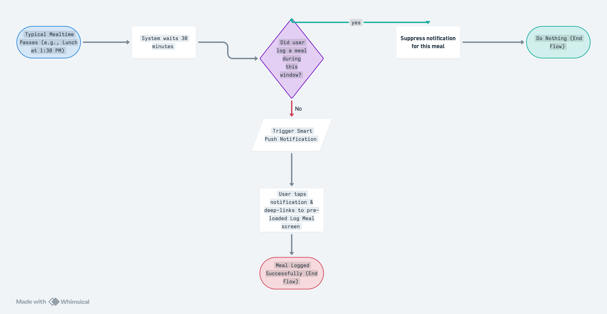
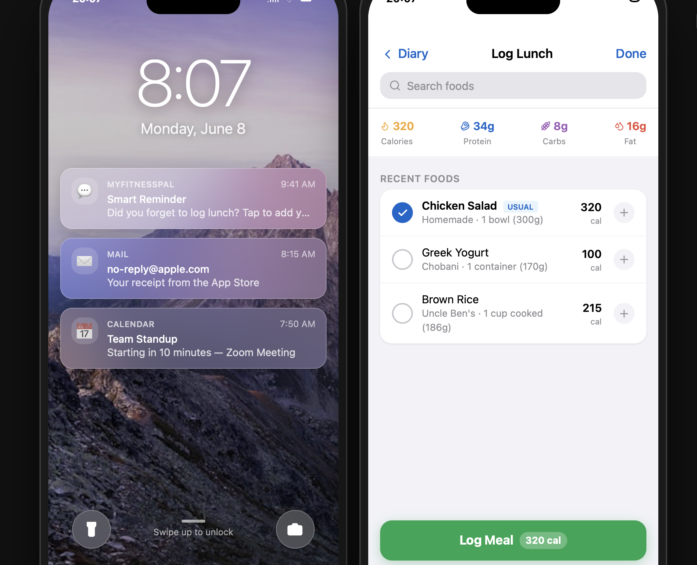

# MyFitnessPal: Smart Habit Reminders (PRD Case Study)

## 1. Project Overview
An intelligent, context-aware notification system designed to eliminate meal-logging friction by predicting user behavior and providing deep-linked, pre-loaded entry screens.

---

## 2. Core Logic & User Flow
The system monitors user activity during calibrated meal windows and determines actions based on database states.

### System Flowchart

---

## 3. Functional Requirements
### A. Condition Check
* The system initiates a database check 30 minutes after the user's calibrated mealtime.
* **Logic:** If `meal_logged == FALSE`, trigger push notification. If `meal_logged == TRUE`, suppress notification.

### B. User Interactivity & Deep Linking
* **Frictionless Entry:** Tapping the push notification bypasses the app home screen. It deep-links directly to the **Log Meal** page with "Recent/Frequent Foods" pre-loaded.

---

## 4. UI Mockups & Experience Design
The interface visualizes a zero-friction user path from lock-screen delivery to a successful one-tap log action.

